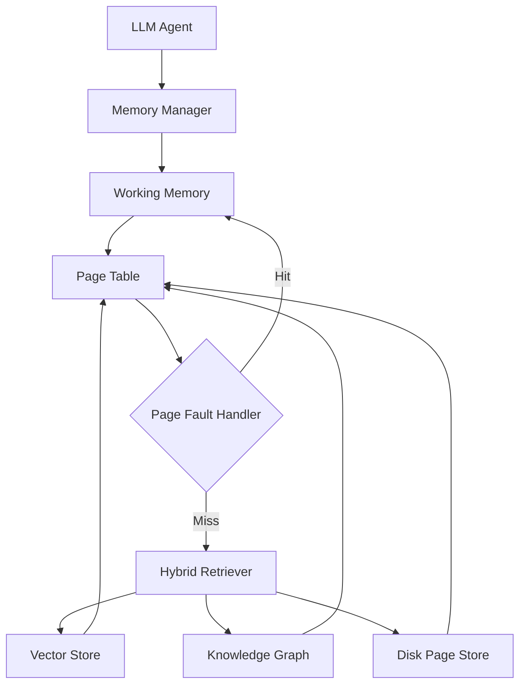

<div align="center">

# NeuroPager

### A Neuro-Symbolic Virtual Memory Manager for Lifelong LLM Agents

[](LICENSE)
[](pyproject.toml)
[](https://github.com/psf/black)
[](https://github.com/astral-sh/ruff)
[](.github/workflows/ci.yml)
[](docs/roadmap.md)
[](CONTRIBUTING.md)

**[Documentation](docs/) · [Architecture](docs/architecture.md) · [Roadmap](docs/roadmap.md) · [Research Vision](docs/research.md) · [Contributing](CONTRIBUTING.md)**

</div>

---

## Overview

**NeuroPager** brings operating-system-grade virtual memory design to LLM
agent memory. Instead of treating agent memory as one flat, undifferentiated
vector index, NeuroPager organizes it the way a modern OS manages RAM and
disk: a bounded **working memory**, a **page table** tracking residency and
access patterns, a **page fault handler** that services misses on demand,
and pluggable **page replacement policies** that decide what gets evicted
and when.

On top of that substrate sits a **neuro-symbolic hybrid retrieval layer** —
dense vector search fused with a symbolic knowledge graph — so memory
misses are resolved with both semantic similarity *and* explicit,
explainable relational structure.

> **Project status:** NeuroPager is currently a research-grade repository
> scaffold. Interfaces, module structure, and documentation are complete;
> algorithmic implementations are intentionally not yet written. See
> [Project Status](#project-status) and the [Roadmap](docs/roadmap.md).

## Motivation

Lifelong LLM agents — assistants, autonomous workers, long-running
copilots — accumulate context that will never fit in any context window.
The standard answer today is retrieval-augmented generation over a single
vector store. That approach has no notion of:

- **Working set locality** — which memories are "hot" right now vs. merely
  stored somewhere.
- **Principled eviction** — what to forget, and when, under a fixed budget.
- **Structured recall** — explicit relational reasoning, not just
  similarity.
- **Provenance** — *why* a given memory was surfaced for a given query.

Operating systems solved a structurally similar problem decades ago:
programs whose working data exceeds physical RAM. NeuroPager asks whether
that same abstraction — paging, replacement policies, demand-fault
retrieval — transfers productively to LLM agent memory. See
[docs/research.md](docs/research.md) for the full research framing.

## Research Problem

> Can an OS-inspired virtual memory abstraction, combined with
> neuro-symbolic hybrid retrieval, improve the efficiency and quality of
> long-horizon LLM agent memory compared to flat retrieval-augmented
> generation — and which page replacement policies best fit the access
> patterns real agents exhibit?

## Architecture



The **Memory Manager** is the agent-facing entry point. It delegates to
**Working Memory** (the resident, hot context set), which is tracked by a
**Page Table** recording residency and access metadata. When requested
content isn't resident, a **Page Fault Handler** is invoked, which queries
the **Hybrid Retriever** — fusing results from a dense **Vector Store** and
a symbolic **Knowledge Graph** — and, if necessary, falls back to the
durable **Disk Page Store**. Retrieved content is installed into working
memory, evicting via a pluggable replacement policy if capacity is
exceeded.

Full component-by-component detail: [docs/architecture.md](docs/architecture.md).
Memory content model (episodic / symbolic / semantic): [docs/memory.md](docs/memory.md).
Interface-level design contracts: [docs/design.md](docs/design.md).

## Repository Structure

```
neuropager/
├── .github/          # Issue/PR templates, CI workflows, CODEOWNERS
├── assets/           # Static assets for docs/README
├── benchmarks/       # Evaluation suites (traces, tasks, results)
├── configs/          # config.yaml, logging.yaml
├── docker/           # Dev container (Dockerfile, docker-compose.yml)
├── docs/             # architecture, memory, design, api, research, roadmap
├── examples/         # Runnable usage examples
├── experiments/      # Reproducible experiment configs + results
├── notebooks/        # Exploratory analysis notebooks
├── scripts/          # Dev/ops utility scripts
├── src/neuropager/   # The installable package
│   ├── core/          # MemoryManager, WorkingMemory, PageTable, PageFaultHandler
│   ├── memory/         # EpisodicMemory, KnowledgeGraph, VectorStore, DiskPageStore
│   ├── retrieval/      # HybridRetriever
│   ├── policies/       # PageReplacementPolicy + LRU / LFU / FIFO
│   ├── agents/          # BaseAgent integration interface
│   ├── utils/            # Shared types, logging utilities
│   └── settings.py       # Typed configuration schema
├── tests/            # unit/ + integration/
├── pyproject.toml
└── Makefile
```

## Features

- 🧠 **OS-inspired memory paging** — working memory, page table, page
  faults, and pluggable replacement policies, mirroring decades of
  battle-tested virtual memory design.
- 🕸️ **Neuro-symbolic hybrid retrieval** — dense vector search fused with
  a symbolic knowledge graph for both fuzzy recall and explainable,
  structured reasoning.
- 🔌 **Pluggable everything** — replacement policies, vector store
  backends, and knowledge graph backends are defined as swappable
  interfaces, not baked-in implementations.
- 🧪 **Research-first** — designed to support rigorous, reproducible
  evaluation against offline-optimal baselines (e.g., Belady's algorithm).
- 🛠️ **Production-grade scaffolding** — typed, documented, linted,
  tested, containerized, and CI-ready from the first commit.

## Roadmap

| Phase | Focus | Status |
| --- | --- | --- |
| 0 | Repository scaffold, docs, config, CI | ✅ Complete |
| 1 | Core virtual memory substrate (working memory, page table, page faults, LRU/FIFO) | ⬜ Planned |
| 2 | Memory subsystems (episodic, vector store, knowledge graph, disk store) | ⬜ Planned |
| 3 | Hybrid retrieval fusion | ⬜ Planned |
| 4 | Learned & adaptive replacement policies, offline-optimal baselines | ⬜ Planned |
| 5 | Agent integration & benchmark suite | ⬜ Planned |
| 6 | Public API stabilization (`1.0`) & research publication | ⬜ Planned |

Full detail: [docs/roadmap.md](docs/roadmap.md).

## Installation

> NeuroPager is not yet published to PyPI — install from source.

```bash
git clone https://github.com/kavimugilsk/neuropager.git
cd neuropager
python -m venv .venv
source .venv/bin/activate  # Windows: .venv\Scripts\activate
pip install -e ".[dev]"
```

Or via Docker:

```bash
docker compose -f docker/docker-compose.yml up -d
docker exec -it neuropager-dev bash
```

## Quick Start

> ⚠️ Core memory operations are currently interface-only stubs (they raise
> `NotImplementedError`). The snippet below shows the **intended** shape of
> the API once [Phase 1](docs/roadmap.md#phase-1--core-virtual-memory-substrate)
> lands.

```python
from neuropager.core.memory_manager import MemoryManager
from neuropager.core.page_fault import PageFaultHandler
from neuropager.core.page_table import PageTable
from neuropager.core.working_memory import WorkingMemory
from neuropager.memory.knowledge_graph import KnowledgeGraph
from neuropager.memory.vector_store import VectorStore
from neuropager.policies.lru import LRUPolicy
from neuropager.retrieval.hybrid_retriever import HybridRetriever

working_memory = WorkingMemory(capacity=128)
page_table = PageTable()
retriever = HybridRetriever(
    vector_store=VectorStore(embedding_dim=768),
    knowledge_graph=KnowledgeGraph(),
)
fault_handler = PageFaultHandler(
    working_memory=working_memory,
    page_table=page_table,
    retriever=retriever,
    policy=LRUPolicy(),
)

memory = MemoryManager(working_memory, page_table, fault_handler)

memory.put("user:preferences", {"theme": "dark"})
page = memory.get("user:preferences")  # resolves from working memory or triggers a page fault
```

## Example Usage

See [`examples/`](examples/) for runnable scripts once implementations
land, and [`docs/design.md`](docs/design.md) for the full interface
contracts of every module referenced above.

## Project Status

NeuroPager is **pre-alpha**. This repository currently provides:

- ✅ A complete, professional repository structure
- ✅ Fully documented, typed Python package interfaces (no business logic)
- ✅ Architecture, design, memory-model, and research documentation
- ✅ CI, linting, formatting, type-checking, and test scaffolding
- ✅ Docker development environment
- ⬜ Algorithmic implementations (see [Roadmap](docs/roadmap.md))

No backward-compatibility guarantees are made until `1.0`.

## Future Work

- Learned / adaptive page replacement policies beyond classical LRU/LFU
- Pluggable production vector store and graph database backends
- A benchmark suite for long-horizon agent memory evaluation
- An accompanying research paper (see [Research Vision](docs/research.md))

## Research Vision

NeuroPager is intended to eventually accompany an academic publication
exploring whether OS-inspired virtual memory abstractions improve
long-horizon LLM agent performance, and which replacement policies best
match real agent memory access patterns. Read the full framing, open
research questions, and evaluation philosophy in
[docs/research.md](docs/research.md).

## Citation

If NeuroPager informs your research, please cite it using the metadata in
[`CITATION.cff`](CITATION.cff):

```bibtex
@software{neuropager,
  author  = {SK, Kavimugil},
  title   = {NeuroPager: A Neuro-Symbolic Virtual Memory Manager for Lifelong LLM Agents},
  year    = {2026},
  url     = {https://github.com/kavimugilsk/neuropager},
  version = {0.1.0}
}
```

## Contributing

Contributions are welcome — from documentation and design discussion to
implementation once interfaces stabilize. Please read
[CONTRIBUTING.md](CONTRIBUTING.md) for development setup, coding
standards, and the PR process, and [CODE_OF_CONDUCT.md](CODE_OF_CONDUCT.md)
for community expectations. Security issues should be reported per
[SECURITY.md](SECURITY.md) rather than filed as public issues.

## License

NeuroPager is released under the [MIT License](LICENSE).

## Acknowledgements

NeuroPager's design draws inspiration from decades of operating systems
research on virtual memory and cache replacement (LRU, LFU, ARC, Belady's
algorithm), from cognitive science's models of episodic vs. semantic
memory, and from the broader neuro-symbolic AI and retrieval-augmented
generation communities. See [docs/research.md](docs/research.md#related-work-to-be-expanded)
for related work as it is compiled.

---

<div align="center">

Built as a research-grade foundation — not a toy project.

</div>
