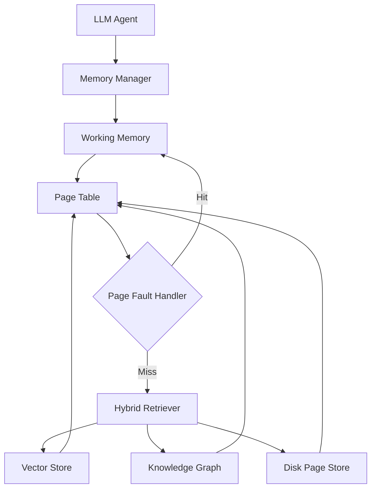

# Architecture

This document describes the high-level architecture of NeuroPager: how its
subsystems are organized, how they interact, and the rationale behind the
operating-system-inspired design.

> **Status:** Architectural scaffold. Interfaces described here exist as
> typed stubs in `src/neuropager/`; algorithmic implementations are not yet
> written. See [roadmap.md](roadmap.md) for sequencing.

## Design Philosophy

Lifelong LLM agents accumulate far more context than fits in any model's
context window. Traditional RAG pipelines treat memory as a flat vector
index — a single, undifferentiated store with no notion of recency,
working set, or eviction. NeuroPager instead borrows a model that has
scaled to arbitrarily large, arbitrarily long-lived systems for decades:
**operating system virtual memory**.

The mapping is deliberate:

| OS Concept              | NeuroPager Concept                                   |
| ------------------------ | ----------------------------------------------------- |
| RAM (working set)         | Working Memory — the agent's active context window    |
| Disk                       | Disk Page Store — durable, cold storage for old memory |
| Page Table                | Maps logical memory "addresses" to physical locations |
| Page Fault                | A retrieval miss — content needed but not resident     |
| Page Replacement Policy   | Eviction strategy for working memory (LRU, LFU, ...)   |
| Virtual Memory Manager    | Orchestrates all of the above                          |

Layered on top of this OS-inspired substrate is a **neuro-symbolic**
retrieval layer: dense vector search (the "neuro" side, for semantic
similarity) combined with a symbolic knowledge graph (the "symbolic" side,
for explicit relations, entities, and structured facts). Hybrid retrieval
lets NeuroPager answer both "what is semantically similar to this" and
"what do we explicitly know is connected to this."

## System Diagram

## Component Overview

### Memory Manager (`neuropager.core.memory_manager`)

The top-level orchestrator. The agent-facing entry point for reading and
writing memory. Delegates to working memory, the page table, and the page
fault handler. Analogous to an OS kernel's virtual memory subsystem.

### Working Memory (`neuropager.core.working_memory`)

A bounded, fast-access store representing the agent's current context
window — the "resident set" of memory pages actively available to the LLM
during generation.

### Page Table (`neuropager.core.page_table`)

Maps logical memory identifiers (e.g., a memory unit's ID) to their
physical location: resident in working memory, or paged out to the vector
store, knowledge graph, or disk store. Tracks metadata needed by
replacement policies (recency, frequency, dirty bits, etc.).

### Page Fault Handler (`neuropager.core.page_fault`)

Invoked when the memory manager requests a memory unit not currently
resident in working memory. Responsible for triggering retrieval via the
hybrid retriever and installing the result into working memory (which may,
in turn, trigger eviction via the active replacement policy).

### Page Replacement Policies (`neuropager.policies`)

Pluggable eviction strategies (LRU, LFU, FIFO, and future
learned/hybrid policies) implementing a common `PageReplacementPolicy`
interface. Chosen and injected at `MemoryManager` construction time.

### Episodic Memory (`neuropager.memory.episodic`)

Stores time-ordered records of agent experience (interactions, observations,
outcomes) — the raw substrate from which both vector embeddings and
knowledge-graph facts may be derived.

### Knowledge Graph (`neuropager.memory.knowledge_graph`)

Symbolic store of entities and typed relations extracted from episodic
memory, enabling structured, explainable retrieval that complements dense
vector similarity.

### Vector Store (`neuropager.memory.vector_store`)

Dense embedding index for semantic similarity search over memory content.
Pluggable backend (in-memory, FAISS, external vector DB, etc.).

### Disk Page Store (`neuropager.memory.disk_store`)

Durable, cold storage for memory pages evicted from working memory and not
otherwise indexed. The "swap space" of the system.

### Hybrid Retriever (`neuropager.retrieval.hybrid_retriever`)

Combines vector store and knowledge graph results into a single ranked
retrieval response, used by the page fault handler to service misses.

## Data Flow

1. The **LLM Agent** requests memory content (e.g., "what do I know about
   entity X") through the **Memory Manager**.
2. The Memory Manager checks the **Page Table** for residency.
3. **Hit:** content is already in **Working Memory** — served immediately.
4. **Miss:** a **Page Fault** is raised. The **Page Fault Handler** invokes
   the **Hybrid Retriever**, which queries the **Vector Store** and
   **Knowledge Graph** in parallel and merges results.
5. Retrieved content is installed into Working Memory. If Working Memory is
   full, the active **Page Replacement Policy** selects a victim page to
   evict, potentially flushing it to the **Disk Page Store**.
6. The Page Table is updated to reflect new residency state.

## Extension Points

NeuroPager is designed to be extended at well-defined seams:

- New **page replacement policies** by implementing `PageReplacementPolicy`.
- New **retrieval backends** by implementing the vector store / knowledge
  graph interfaces.
- New **memory subsystems** (e.g., procedural memory) as siblings to
  episodic memory, integrated through the memory manager.

See [design.md](design.md) for interface-level detail and
[research.md](research.md) for the open research questions motivating these
extension points.
