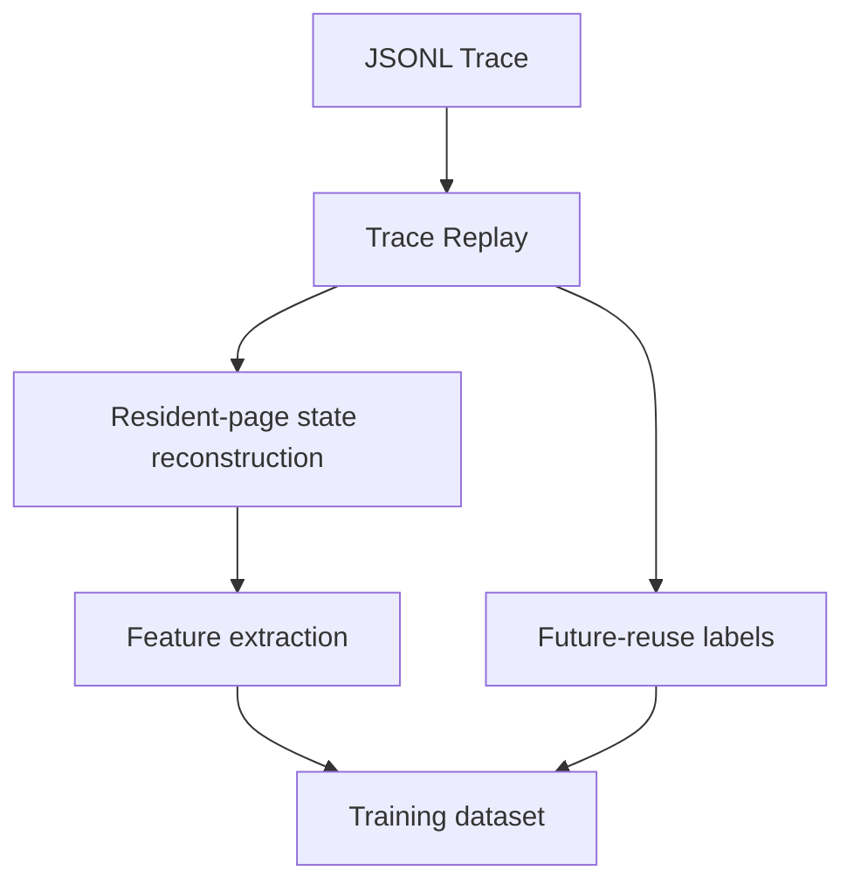

# Offline Dataset Pipeline

This document describes `neuropager.dataset`: the offline pipeline that
turns a completed trace episode (see [memory.md](memory.md) and the trace
infrastructure in `neuropager.trace`) into labeled, tabular training
examples for the planned Memory Utility Model (see
[research.md](research.md)). It implements no learning — only the
ground-truth feature/label extraction a supervised model would later be
trained and evaluated against.

> **Status:** Dataset generation only. The Memory Utility Model itself is
> not implemented — see [roadmap.md](roadmap.md).

## Pipeline



`neuropager.dataset.generator.generate_dataset` (or
`generate_dataset_from_jsonl` for a file on disk) drives the whole
pipeline. See `scripts/demo_dataset.py` for a runnable, minimal example.

## What an example represents

One `DatasetExample` is one **candidate page at one capacity-triggered
eviction decision, labeled for one horizon**. If a decision point had 3
resident pages and the pipeline is run for 5 horizons, that single
decision point produces 15 examples — one per (candidate, horizon) pair.
Explicit evictions (`MemoryManager.evict()`) are not decision points in
this milestone; only decisions where working memory was full and a
replacement policy chose a victim are used.

The eventual research question this dataset supports:

> Can a supervised model, given only a candidate page's access history up
> to the decision tick, predict whether it will be reused soon — and would
> evicting based on that prediction cause fewer page faults than
> FIFO/LRU/LFU/Random?

## Feature definitions

All features are computed by `neuropager.dataset.features.compute_features`
from two already-tick-filtered lists — `access_ticks` and `fault_ticks`,
both restricted to `tick <= decision_tick` — plus `decision_tick` itself.
Let `t` = `decision_tick`, `A` = sorted `access_ticks`, `n = len(A)`,
`F` = sorted `fault_ticks`, and `gaps = [A[i] - A[i-1] for i in 1..n-1]`
(the `n-1` consecutive inter-access gaps).

| Feature | Definition | Undefined when |
|---|---|---|
| `recency` | `t - A[-1]` | `n = 0` |
| `frequency` | `n` | never (0 is a real value) |
| `avg_inter_access_interval` | `mean(gaps)` | `n < 2` |
| `inter_access_interval_variance` | population variance of `gaps` | `n < 2` |
| `fault_count` | `len(F)` | never (0 is a real value) |
| `fault_ratio` | `fault_count / frequency` | `n = 0` |
| `page_age` | `t - A[0]` | `n = 0` |
| `recent_burst` | `count(a in A : a > t - 10)` | never |
| `long_burst` | `count(a in A : a > t - 50)` | never |
| `recent_interval` | `gaps[-1]` | `n < 2` |
| `normalized_recency` | `recency / page_age` | `n = 0` or `page_age = 0` |
| `elapsed_since_fault` | `t - F[-1]` | `len(F) = 0` |
| `max_historical_interval` | `max(gaps)` | `n < 2` |

Every "undefined when" case resolves to
`MISSING_HISTORY_SENTINEL = -1.0` rather than raising, `NaN`, or `inf` —
all genuine feature values are `>= 0`, so `-1.0` is unambiguous and stays
finite (required for `neuropager.dataset.validation.validate_dataset`,
which rejects non-finite values outright). `recent_burst`/`long_burst`
window widths (10 and 50 ticks) are fixed constants
(`RECENT_BURST_WINDOW`, `LONG_BURST_WINDOW`), matching the precedent set by
`PageTable`'s `RECENT_ACCESS_WINDOW`.

No feature is derived from `page_id` itself (no hash, no identity signal)
— every feature is purely a function of *when* the page was used, not
*which* page it is, so the model cannot memorize specific page identities
instead of learning generalizable temporal patterns.

## Label definition

```
y(p, t, H) = 1  if page p has an access tick in (t, t + H]
             0  otherwise
```

- The window is **open** at `t`: an access exactly at the decision tick is
  not "future reuse" (it would, in any case, belong to a different page —
  the one whose `get`/`put` triggered this decision).
- The window is **closed** at `t + H`: an access exactly at the horizon
  boundary counts as reused.
- If the episode ends before `t + H` is reached and no qualifying access
  was found, the label is `0`. This is a deliberate interpretation, not an
  oversight — see [Ambiguities](#ambiguities-flagged-for-research-lead-approval).

Supported horizons: `H ∈ {25, 50, 100, 200, 500}`
(`neuropager.dataset.labels.DEFAULT_HORIZONS`), configurable per call to
`generate_dataset`.

## Leakage prevention

Two structurally separate code paths read the same underlying trace with
deliberately different visibility:

- **Features** (`neuropager.dataset.features.compute_features`) receive
  only `access_ticks_up_to(page, decision_tick)` and
  `fault_ticks_up_to(page, decision_tick)` from
  `neuropager.dataset.replay.TraceReplay` — both already filtered to
  `tick <= decision_tick` before the function ever sees them. There is no
  parameter through which a future tick could reach this function.
- **Labels** (`neuropager.dataset.labels.compute_label`) receive
  `full_access_ticks(page)` — deliberately unfiltered — because label
  generation runs *after* the episode is already complete, offline. This
  is safe precisely because a label is never fed back into anything that
  makes a decision; it only ever becomes the target column of a
  supervised-learning row, computed once, after the fact.

This mirrors — and depends on — an invariant already enforced one layer
down: **runtime replacement policies never receive future information**.
`PageReplacementPolicy.select_victim(self, page_table)` (see
`neuropager.policies.base`) accepts only a `PageTable`, which itself only
ever holds state derived from ticks at or before "now." The trace
milestone added regression tests locking this signature in place
(`test_policy_interface_has_no_trace_or_future_parameter`) and proving no
runtime call site ever passes anything else
(`test_select_victim_is_only_ever_called_with_the_page_table`). The
dataset pipeline's own leakage tests (`test_features_never_see_the_future`
in `tests/integration/test_dataset_generation.py`) prove the analogous
property one layer up: truncating a trace at the decision tick and
recomputing features from the truncated trace yields *identical* output —
literally removing the future data does not change a single feature
value.

The one policy that appears to violate this rule —
`neuropager.policies.belady_min.BeladyMinPolicy` — does not: it receives
the full future reference string at **construction time**, not through
`select_victim`'s signature, and exists solely as an offline upper-bound
baseline, never as something a real online agent would run. Labels in this
dataset pipeline are the same kind of deliberate, explicit,
clearly-documented exception — never a decision-time leak.

## Ambiguities flagged for research-lead approval

See the final report for the full list; the most consequential one is
repeated here: horizons that extend past the end of an episode currently
label as `0` (not reused) rather than being excluded or flagged. This
means examples near the end of a short episode are systematically biased
toward negative labels for large horizons, for a reason unrelated to the
page's actual reuse pattern. No `horizon_truncated` flag is added to the
schema (item 5 specifies an exact field list); this should be revisited if
label noise near episode ends turns out to matter for training.
