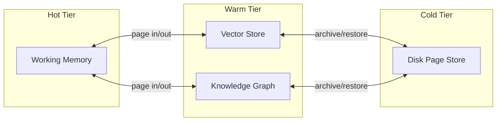

# Memory Model

NeuroPager's memory model separates *what is remembered* (memory content)
from *how it is organized and paged* (the virtual memory substrate). This
document covers the former; see [architecture.md](architecture.md) for the
latter.

## Memory Tiers

NeuroPager organizes agent memory into tiers analogous to a memory
hierarchy in computer architecture — trading capacity for access latency
and recency:

- **Hot (Working Memory):** the LLM's active context. Smallest capacity,
  lowest latency, directly consumable by the model.
- **Warm (Vector Store + Knowledge Graph):** indexed, queryable memory not
  currently in the context window but retrievable in one hop.
- **Cold (Disk Page Store):** durable archive of memory pages, retrievable
  but not indexed for fast semantic or symbolic query — the equivalent of
  swap space.

## Memory Content Types

### Episodic Memory

Time-ordered records of what the agent has observed, done, or been told.
Episodic memory is the raw log from which derived representations (vector
embeddings, knowledge graph triples) are constructed. Conceptually similar
to episodic memory in cognitive science: memory of specific experienced
events, as opposed to general facts.

### Symbolic / Knowledge Graph Memory

Structured facts extracted from episodic memory (or provided directly):
entities, relations, and attributes. Enables:

- Explicit multi-hop reasoning ("what do we know that connects X and Y")
- Consistency checks and contradiction detection
- Explainable retrieval (a graph path is a human-readable justification)

### Semantic / Vector Memory

Dense embeddings of memory content enabling approximate nearest-neighbor
retrieval by meaning rather than exact match. Handles paraphrase, fuzzy
recall, and open-ended similarity queries that symbolic lookups cannot.

## Why Hybrid Retrieval

Neither retrieval mode is sufficient alone:

- **Vector-only** retrieval is powerful for fuzzy semantic recall but
  cannot answer structured questions reliably, and offers no explicit
  provenance for *why* a result was retrieved.
- **Graph-only** retrieval is precise and explainable but brittle to
  paraphrase and incomplete extraction — it only knows what was explicitly
  modeled as a triple.

NeuroPager's `HybridRetriever` (see [architecture.md](architecture.md#hybrid-retriever-neuropagerretrievalhybrid_retriever))
is the seam where both signals are combined into a single ranked result
set servicing page faults.

## Addressing Model

Every memory unit is assigned a logical identifier used consistently across
tiers (working memory, vector store, knowledge graph, disk store) so the
page table (see [architecture.md](architecture.md#page-table-neuropagercorepage_table))
can track a single item's residency regardless of *which* tier currently
holds it. The identifier scheme and metadata schema are defined in
`neuropager.utils.types`.

## Open Questions

See [research.md](research.md) for open research questions specific to
memory representation — e.g., how episodic events are summarized/compacted
over time, and how contradictions between symbolic and vector-derived
knowledge should be resolved.
