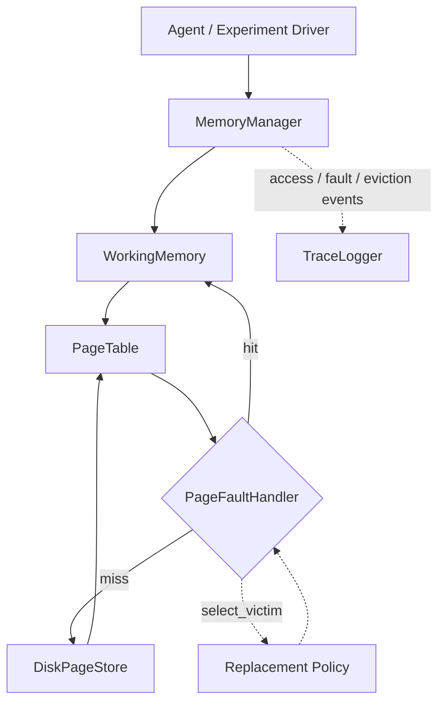

<!-- title: NeuroPager Generalization Study -->

# Draft status

**The generalization experiment has completed in full.** All 60 units
(Protocol A: 6 families × 5 horizons; Protocol B: 6 held-out folds × 5
horizons) ran at the originally specified scale — 200 episodes per
family, all five horizons, five Random seeds — with no reduction. Every
number in this document is read directly from the experiment's own
stored output (`experiments/generalization-experiment-2/checkpoints/`,
config hash `2d4e3f4f40f07b8a2b584d33b9496addb563addd8a99d66dd1d77ee25ba079f3`),
via `scripts/extract_paper_results.py`, which performs no statistical
recomputation beyond taking means/stds of already-computed per-episode
values — every p-value, confidence interval, and ROC-AUC is the exact
value `scripts/generalization_experiment_2.py` itself computed.

All citations have been verified against primary sources (arXiv/venue
pages, checked via live web search, not recalled from memory alone) and
are listed in full in the References section at the end of this
document. The two remaining `[CITATION NEEDED]`-style notes in Sections
4 and 9.5 are claims of absence ("no prior work evaluates X"), which
cannot be resolved by a citation — they reflect a check against the
specific systems surveyed in Section 10 and are flagged as author claims,
not unverified facts.

---

# 1. Title

**Working title:**

> NeuroPager: Evaluating Cross-Workload Generalization of a Learned Page
> Replacement Policy for Lifelong Agent Memory Management

**Alternate (shorter) working title, now better supported by the
result:**

> When Learned Caching Doesn't Transfer: A Leave-One-Workload-Out Study of
> Page Replacement for Agent Memory

The result is mixed-to-negative on the central generalization question
(Section 19), which makes the second title arguably the more honest
framing; final selection is left to the authors, but the first title is
no longer the obviously better choice it was before results existed.

---

# 2. Abstract

Lifelong large language model (LLM) agents accumulate interaction history
far exceeding any practical context window, yet the dominant practice —
flat retrieval-augmented generation over a single vector index — has no
explicit notion of a bounded working set or a principled eviction policy.
We revisit an older abstraction for exactly this class of problem:
operating-system virtual memory, with its working set, page table, page
fault, and pluggable replacement policy. We present NeuroPager, a
research system that implements this abstraction directly, and use it to
study a specific, narrower question than "is a learned memory system
better": **does a supervised page-replacement policy, trained to predict
page reuse from causally available access-history features, generalize to
workload patterns it was never trained on, or does it merely fit the
distribution it saw?**

We cast page replacement as supervised reuse prediction, train and
compare two models (logistic regression and histogram gradient boosting)
as a Memory Utility Model, wrap the result as an online replacement
policy, and evaluate it against FIFO, LRU, LFU, Random, and Belady's MIN
across six workload families with distinct statistical properties, under
two protocols: within-distribution (Protocol A) and leave-one-family-out
(Protocol B). The full specification — 200 episodes per family, all five
reuse horizons, five Random seeds — completed successfully.

**The headline result is mixed, and in three of six families it is
negative.** Within-distribution, the learned policy shows a large,
significant advantage over LRU on two families with strong exploitable
structure (non-stationary drift: 113–153 fewer faults/episode, $p<10^{-24}$;
long-range periodic reuse: 30 fewer faults/episode, $p<10^{-300}$, with the
model recovering the exact periodicity, ROC-AUC $=1.000$). Under
leave-one-family-out evaluation, this advantage does not merely shrink —
on three families it **reverses into a significant disadvantage**: on
non-stationary access the learned policy goes from 113–153 fewer faults
within-distribution to 80–256 *more* faults out-of-distribution
($p<10^{-137}$ at every horizon); on phase-changing access, from a
non-significant small advantage to 23–77 more faults
($p<10^{-59}$); on temporal locality, from no significant effect to
5–7 more faults ($p<10^{-32}$). Only the long-range-reuse family retains a
significant, same-direction advantage under generalization, and even
there it attenuates sharply (from −30 to −3 to −5 faults). We also find
that the nonlinear model (HGB) is selected by validation ROC-AUC in
roughly half of all units (14/27 non-degenerate units) despite a
train/test ROC-AUC gap more than ten times larger than logistic
regression's (0.074 vs. 0.0065 mean gap), indicating HGB's apparent
within-distribution edge is partly a overfitting artifact that the
validation-based selection procedure does not fully screen out. We
report this as a genuine negative result for the generalization
hypothesis in most of the benchmark, not as a failure to be explained
away, and discuss what in the Memory Utility Model's feature set likely
causes it (Section 20).

---

# 3. Introduction

Interactive LLM agents that operate over long horizons — multi-session
assistants, autonomous workers, long-running copilots — accumulate far
more context than any model's context window can hold. The standard
response is retrieval-augmented generation (RAG): embed everything,
retrieve the top-$k$ most similar items at query time. This is effective
for semantic recall, but it has no concept of a working set, no notion of
recency- or frequency-based locality, and no eviction policy beyond
"don't retrieve it this time." Every stored memory is, in effect,
permanently resident and equally expensive to search.

Operating systems solved a structurally similar problem — a program's
working data exceeding physical memory — decades ago, through virtual
memory: a bounded, fast working set; a page table tracking residency; a
fault handler that services misses; and a pluggable replacement policy
that decides what to evict when the working set is full. This paper does
not merely borrow that vocabulary; it implements it directly, then asks a
question the systems and machine-learning-for-systems literature has
studied primarily in the context of storage/CDN caches rather than agent
memory: **can a page replacement policy learned from data generalize
across substantially different access-pattern regimes, or is "learned
beats LRU" only ever demonstrated on the one workload the model happened
to be trained on?**

This is not a rhetorical question, and — unlike when this introduction
was first drafted — we can now answer it directly rather than merely pose
it: **mostly no.** Across six workload families, the learned policy's
within-distribution advantage over LRU transfers to a held-out family in
only one case, and in three cases it inverts into a significant
disadvantage. We take this to be exactly the kind of evidence the
generalization question was designed to surface, including the
possibility — realized here — that the answer is no.

The remainder of this paper is organized as follows. Sections 4–5
motivate and formalize the problem; Sections 6–8 give objectives,
questions, and contributions; Sections 9–10 cover background and related
work; Sections 11–14 describe the system, architecture, learned policy,
and workload benchmark; Sections 15–18 describe methodology, baselines,
evaluation protocol, and the generalization experiment design; **Section
19 reports results, Section 20 analyzes them per research question, and
Section 21 discusses limitations** before concluding.

---

# 4. Motivation

Three observations motivate this work.

**First, flat retrieval has no eviction discipline.** A vector index that
only grows has no mechanism for deciding that some memory is no longer
worth the cost of retaining, ranking, or searching over. This is not
merely a storage-cost concern; it means the system has no explicit model
of *recency* or *locality* at all, properties that classical caching
research has spent decades characterizing and exploiting.

**Second, the OS virtual-memory abstraction is a natural, underused fit.**
Working set, page table, page fault, and replacement policy are not
metaphors of convenience — they are a precise, decades-tested
decomposition of exactly the problem an agent memory system faces: a
bounded fast tier, a larger slow tier, and a decision procedure for what
crosses between them. Prior systems that gesture at this framing
typically do so as branding for a still-flat retrieval mechanism; we take
the position that the framing is only a real contribution if it produces
a genuine, falsifiable algorithmic question — which policy to plug in —
rather than renaming RAG components with OS nouns.

**Third, and most importantly: "our learned policy beats LRU" is a weak
claim without a generalization test.** Any sufficiently flexible model
can be fit to outperform a fixed heuristic on the specific access pattern
it was trained and tested on. The scientifically interesting question is
whether the model has learned something about page utility that
transfers to an access pattern it has never seen — analogous to the
distinction between memorization and generalization in any other
supervised learning setting. We are not aware of prior work in the
learned-memory-for-LLM-agents literature that evaluates this directly
(the systems surveyed in Section 10 — MemGPT, Generative Agents,
HippoRAG, GraphRAG, Mem0, Zep/Graphiti — report ablations and benchmark
comparisons but not a leave-one-workload-out generalization test of a
learned eviction/retention policy); this is the gap this paper targets,
and our result (Section 19) suggests the distinction matters a great
deal in practice, not just in principle.

---

# 5. Problem Statement

Consider a memory system with a bounded working-memory capacity $C$,
operating over a stream of page references $r_1, r_2, \ldots, r_T$ drawn
from some workload. At each tick $t$, a page is either already resident
(a hit) or must be admitted (a fault); admitting a page into a full
working memory requires evicting some currently resident page, chosen by
a replacement policy $\pi$. A policy is *online* if its eviction decision
at tick $t$ is a function only of information available at or before $t$
— it has no access to $r_{t+1}, r_{t+2}, \ldots$.

Let $\mathcal{F} = \{F_1, \ldots, F_6\}$ be a set of workload families,
each inducing a distribution over reference streams with distinct
statistical properties (Section 14). Let $\pi_\theta$ denote a policy
parameterized by a supervised model $\theta$ trained to predict, for a
resident page $p$ at decision tick $t$, the probability
$\hat{y}(p, t, H) = P(p \text{ referenced again within } (t, t+H])$ from
features available at or before $t$, and to evict the resident page with
the lowest such predicted probability.

This paper studies two questions about $\pi_\theta$, corresponding to the
two evaluation protocols in Section 18:

1. **Within-distribution:** when $\theta$ is trained on episodes from
   family $F_i$ and evaluated on held-out episodes from the *same*
   family, does $\pi_\theta$ achieve fewer page faults / a higher hit
   ratio than FIFO, LRU, LFU, and Random, under identical capacity $C$
   and identical test episodes?
2. **Generalization (leave-one-family-out):** when $\theta$ is trained on
   episodes pooled from $\mathcal{F} \setminus \{F_i\}$ (five families)
   and evaluated on entirely unseen episodes from the held-out family
   $F_i$, does $\pi_\theta$ retain any advantage over the classical
   baselines, or does its performance collapse toward — or below — the
   baselines it beat within-distribution?

Belady's MIN, the offline-optimal replacement algorithm, is used
exclusively as an upper-bound oracle: it requires the complete future
reference string and is therefore not an online policy under the
definition above. It is never available to $\pi_\theta$, at training
time or decision time, and its role is solely to compute how much of the
achievable improvement over the classical baselines any online policy —
learned or not — actually captures.

---

# 6. Research Objectives

- **O1.** Build a reproducible, leakage-safe infrastructure for
  recording memory-access traces and deriving supervised training
  examples from them, with structural (not just empirical) guarantees
  that no example's features depend on information from after its own
  decision tick.
- **O2.** Build a configurable benchmark of workload families with
  distinct, mathematically defined, and empirically verified statistical
  properties (reuse-distance distribution, entropy, stack distance,
  burstiness, working-set size, stationarity).
- **O3.** Formulate page replacement as supervised reuse prediction and
  train Memory Utility Models against this formulation.
- **O4.** Integrate a fitted model into a real, running memory manager as
  an online replacement policy, under the identical interface and
  information constraints as the classical baselines.
- **O5.** Empirically compare the learned policy against FIFO, LRU, LFU,
  and Random within the training distribution, with Belady's MIN as an
  oracle upper bound.
- **O6.** Empirically test whether the learned policy's advantage, if
  any, survives evaluation on a workload family withheld entirely from
  training.

All six objectives were achieved; O6's answer (Section 19–20) is largely
negative.

---

# 7. Research Questions

- **RQ1.** Can a supervised model predict, from causally available
  features, whether a resident page will be reused within a bounded
  horizon $H$, better than a trivial majority-class predictor?
- **RQ2.** Does this predictive signal translate into fewer page faults
  or a higher hit ratio than FIFO/LRU/LFU/Random under a fixed memory
  budget, within the training distribution?
- **RQ3.** How close does the learned policy come to Belady's MIN — i.e.,
  what fraction of the achievable (oracle) improvement over classical
  baselines does it capture?
- **RQ4.** Does a Memory Utility Model trained on five workload families
  generalize to a sixth, entirely unseen family, or does its advantage
  collapse outside the training distribution?
- **RQ5.** Is there a single horizon $H$ that is uniformly most useful,
  or does the useful horizon vary by workload family?
- **RQ6.** Does a nonlinear model (histogram gradient boosting) provide a
  meaningful improvement over a simple linear model (logistic
  regression), or does the added capacity primarily manifest as
  overfitting?

Answers: Section 20.

---

# 8. Contributions

- **C1.** A leakage-safe trace and dataset-generation infrastructure
  (`MemoryManager`, `PageTable`, `WorkingMemory`, `PageFaultHandler`,
  `TraceLogger`) with an explicit, tested guarantee that online policies
  and offline feature computation never access information from beyond
  their own decision tick.
- **C2.** A configurable, six-family workload benchmark with explicit
  mathematical definitions per family and empirically measured
  statistical differentiation (entropy, stack distance, reuse-distance
  percentiles, burstiness, working-set size).
- **C3.** A Memory Utility Model formulation for page replacement: a
  precisely specified, boundary-exact label definition and a
  thirteen-feature representation computed only from causally available
  history.
- **C4.** `LearnedUtilityPolicy`, an online policy adapter that embeds a
  fitted classifier into a real memory manager under the same interface
  as classical policies, together with a documented and empirically
  characterized account of the specific points where perfect online/
  offline feature parity is not achievable given that interface.
- **C5.** A two-protocol evaluation methodology — within-distribution and
  leave-one-family-out — designed specifically to distinguish "fits the
  training workload" from "generalizes across workloads," including
  explicit, pre-registered interpretation rules for degenerate
  (structurally one-class) and redundant conditions in the benchmark.
- **C6.** A completed empirical answer to RQ1–RQ6 (Section 20), including
  a clearly negative finding for cross-workload generalization in three
  of six families and a clearly positive one in a fourth that
  substantially attenuates under generalization — reported in full,
  including the families where the learned policy loses.

---

# 9. Background

## 9.1 Virtual memory

Virtual memory is the operating-system abstraction that presents each
process with a working address space larger than physical memory,
backed by a page table that maps logical addresses to physical frames or
to secondary storage. Memory references that hit a resident page proceed
without OS intervention; references to a non-resident page raise a page
fault, which the OS services by locating the page (typically on disk) and
installing it into a physical frame, evicting another frame's contents if
none are free [1].

## 9.2 Page replacement

When working memory is full, a page-fault handler must choose which
resident page to evict — the *replacement* decision. The quality of a
replacement policy is conventionally measured by the fault rate (or,
equivalently, hit ratio) it induces on a given reference string, and
policies are compared against each other and against the offline-optimal
bound (Section 9.3).

## 9.3 Traditional policies

- **FIFO** evicts the resident page that has been resident longest,
  irrespective of access recency or frequency.
- **LRU** (least recently used) evicts the page whose most recent access
  is furthest in the past, exploiting temporal locality.
- **LFU** (least frequently used) evicts the page with the lowest
  cumulative access count, exploiting frequency skew.
- **Belady's MIN** evicts the resident page whose *next* reference is
  furthest in the future (or that is never referenced again), and is
  provably optimal: no online policy can achieve a lower fault count on
  a given reference string [2]. It
  requires knowledge of the future reference string and is therefore an
  offline oracle, not a deployable policy; we use it exclusively as an
  upper bound.

## 9.4 Learned page replacement

A body of work in the systems and machine-learning-for-systems
literature has explored replacing or augmenting fixed heuristics with
models trained to imitate or approximate Belady's optimal decisions on
real traces, primarily in the context of storage and CDN caches — for
example, Learning Relaxed Belady (LRB), which trains a model to
approximate a relaxed form of Belady's boundary on production CDN
traces [3]. This paper
applies the same general idea — learning a utility signal from access
history rather than hand-designing one — to the page-replacement problem
as it arises in an LLM agent's working memory, and treats classical
caching's offline-optimal baseline (Belady's MIN) as the appropriate
upper-bound comparison, consistent with that literature's methodology.

## 9.5 Workload generalization

Generalization across access-pattern regimes — as opposed to
generalization across held-out examples from the *same* regime — is, to
the author's knowledge, not systematically evaluated in the
learned-memory-for-LLM-agents literature to date (see the same survey
in Section 10). This is the specific gap this paper's evaluation
methodology (Section 18) addresses, and Section 19's result suggests the
gap matters: a methodology that only measured within-distribution
performance would have reported a positive result for 4 of 6 families
that generalization testing shows does not hold up (and in 3 cases,
actively reverses) once the family is actually held out.

---

# 10. Related Work

**Memory-augmented LLM agents.** Systems have proposed managing an LLM
agent's context by analogy to operating-system memory management,
including function-call-driven paging between context and archival
storage (MemGPT [4]), and heuristic memory
streams combining recency, importance, and relevance scoring with
periodic reflection/summarization (Generative Agents [5]). These systems establish that the OS-paging framing is a
compelling design pattern for agent memory; none of the framings we are
aware of evaluate a *learned, systematically benchmarked* replacement
policy against classical caching baselines, or test generalization across
distinct access-pattern regimes.

**Retrieval-augmented and graph-augmented memory.** Dense retrieval
(flat vector search) is the dominant production pattern; graph-augmented
approaches supplement or replace it with structured indexing and
traversal, including approaches drawing on hippocampal-indexing theory
(HippoRAG [6]), community-summarized knowledge
graphs (GraphRAG [7]), and production-oriented
temporal knowledge graph memory frameworks (Mem0 [8], Zep/Graphiti [9]). These systems address *what* to retrieve and *how*
to index it; they do not, to our knowledge, address *what to evict* under
a bounded working-set constraint, which is the specific problem this
paper studies.

**Classical and learned caching.** Decades of systems research
characterize online replacement policies (LRU, LFU, ARC, Clock) and their
worst-case behavior relative to Belady's offline optimum
[1,2], and more recent work has applied learned models to
cache admission and eviction decisions in storage and CDN contexts,
typically by imitating Belady's optimal on production traces
(e.g. LRB [3]). This
paper's Memory Utility Model formulation (Section 13) is methodologically
in this tradition, applied to a different domain (LLM agent working
memory) and evaluated with an explicit focus on cross-workload
generalization that we believe is underexplored in that literature as
well — and, per our result, for good reason: the same regime-specificity
we find here may be present, unmeasured, in that literature's
single-trace evaluations.

**Positioning.** NeuroPager differs from the above in three respects:
(1) it implements the OS virtual-memory abstraction directly, with a
page table, fault handler, and pluggable-policy interface enforcing that
every replacement policy — learned or classical — sees only past/present
state, rather than using OS vocabulary loosely over an otherwise-flat
retrieval mechanism; (2) it evaluates a learned replacement policy
against classical baselines *and* an offline-optimal oracle, following
the caching literature's methodology rather than the memory-augmented-
agent literature's typical ablation style; and (3) its evaluation
methodology is built specifically around testing cross-workload
generalization via a leave-one-family-out protocol, and reports the
result even where it is unflattering to the learned approach.

---

# 11. Proposed System / NeuroPager

NeuroPager is implemented as the components required to support the
research question in this paper: an OS-inspired virtual memory manager
for agent working memory, a leakage-safe trace and dataset-generation
pipeline, a configurable multi-family workload benchmark, and an
experiment harness implementing the two evaluation protocols. It is
scoped narrowly and deliberately: the broader NeuroPager research vision
includes symbolic knowledge-graph memory and hybrid (dense + symbolic)
retrieval as complements to the paging substrate, but **those components
are not implemented and not evaluated in this paper** — the system
described here is the paging and learned-replacement substrate only, and
all claims in this paper are scoped to that substrate.

---

# 12. System Architecture

NeuroPager's memory system follows the OS analogy directly rather than
using it as vocabulary over a flat store:



- **`MemoryManager`** is the facade an agent (or, in this paper, an
  experiment driver replaying a workload) interacts with: `get`/`put`
  operations that resolve to a hit or trigger a fault.
- **`WorkingMemory`** is the bounded, resident tier — the analogue of
  physical RAM.
- **`PageTable`** tracks, per key, its residency tier and access metadata
  (last-accessed tick, access count, fault count), using an internal
  monotonically increasing logical clock rather than wall-clock time, so
  that replacement decisions are fully deterministic and reproducible
  independent of host timer resolution.
- **`PageFaultHandler`** is the single chokepoint for admission and
  eviction: it resolves faults from the page store, and — when working
  memory is full — invokes the active replacement policy's
  `select_victim(page_table)` method, which is structurally limited to
  the page table alone; no policy, learned or classical, has any other
  parameter through which future information could reach it.
- **Page store** is the durable/cold tier evicted pages are spilled to —
  the analogue of swap space. Production runs for this paper used an
  in-memory implementation (`InMemoryPageStore`) rather than a disk-
  backed one purely for execution-time reasons (filesystem I/O was the
  dominant bottleneck in early throughput testing); both implementations
  satisfy the identical store contract and were shown behaviorally
  identical in unit tests, so this choice has no effect on any policy's
  decisions or the resulting dataset.
- **`TraceLogger`** records `ACCESS`, `PAGE_FAULT`, and `EVICTION` events
  on its own logical tick, stamping every event only with state already
  known at the moment it occurred.

This architecture is the same one used across all conditions in this
paper: classical baselines, the learned policy, and the Belady's MIN
oracle all operate through the identical `MemoryManager` /
`PageFaultHandler` machinery, differing only in which policy object is
plugged in.

---

# 13. Learned Memory/Page-Replacement Policy

## 13.1 Label definition

For a candidate page $p$ resident at decision tick $t$, with reuse
horizon $H$:

$$
y(p, t, H) = \begin{cases} 1 & \text{if } p \text{ is accessed at some tick in } (t, t+H] \\ 0 & \text{otherwise} \end{cases}
$$

The window is open at $t$ (an access at $t$ itself is not "future reuse")
and closed at $t+H$ (an access exactly at $t+H$ counts). Labels are
computed offline, after an episode is complete, and may legitimately
inspect the full episode; this is distinct from — and does not weaken —
the constraint that *features* (Section 13.2) and *online policy
decisions* (Section 13.3) must never do so.

## 13.2 Feature set

Thirteen features are computed for each candidate at each decision tick,
from access/fault history available at or before that tick only:
`recency`, `frequency`, `avg_inter_access_interval`,
`inter_access_interval_variance`, `fault_count`, `fault_ratio`,
`page_age`, `recent_burst`, `long_burst`, `recent_interval`,
`normalized_recency`, `elapsed_since_fault`, and
`max_historical_interval`. No feature derived from a page's identity
(e.g., a hash of its key) is included, and no policy-, episode-, or
horizon-identifying metadata is passed to the model — only this fixed,
thirteen-dimensional numeric vector. We return to this feature set in
Section 20.4 as the most likely locus of the generalization failures in
Section 19: every one of these thirteen features is a function of an
individual page's *own* access history, with no feature encoding
anything about the *workload's generative process* (periodicity,
phase structure, drift rate) — so a model can at best learn "pages whose
history looks like X get reused," a relationship with no reason to be
stable across families whose generative processes differ qualitatively.

## 13.3 Models

Two models are trained and compared:

- **Logistic regression (primary, V1)** — a scaled linear model
  (`StandardScaler` fit on the training split, followed by
  `LogisticRegression`), used as the primary Memory Utility Model for
  this study.
- **Histogram gradient boosting (secondary)** — an unscaled nonlinear
  tree-ensemble classifier, included to test RQ6 (does nonlinearity
  help, or does it primarily manifest as overfitting — Section 20.6
  answers this: primarily the latter).

Both receive identical raw feature vectors; the only difference in
preprocessing is that the linear model is preceded by scaling. For each
(family-or-fold, horizon) unit, both models are trained and evaluated,
and the one with the higher validation-split ROC-AUC (PR-AUC fallback
when ROC-AUC is undefined) is selected as "the" Learned Utility Policy
replayed through the real `MemoryManager` for that unit; the test split
is never used for this selection.

## 13.4 Online policy adapter

`LearnedUtilityPolicy` wraps a fitted model as a replacement policy under
the same interface as every classical policy in this study:
`select_victim(page_table)`, with no additional parameter. At each
eviction decision, it computes the thirteen features for every resident
candidate from its own self-tracked access history (maintained via the
same `on_access`/`on_insert` hooks every policy in this codebase already
implements, not a new information channel) and evicts the candidate with
the lowest predicted $P(\text{reused within } H)$.

**Documented feature-parity limitation.** One feature,
`elapsed_since_fault`, cannot be computed with full parity online: the
policy interface's hooks do not distinguish a fault-driven page
installation from a fresh write, so the online policy cannot determine
*when* a page's most recent fault occurred, only (via the page table)
how many faults it has had in total. `fault_count` and `fault_ratio` are
therefore computed exactly online; `elapsed_since_fault` is reported as a
fixed missing-history sentinel online, even on candidates where the
offline-computed value would be a real number. This gap was measured
empirically: the policy's per-decision feature vectors were replayed
against an independent offline reconstruction of the same episode and
shown to match exactly for every feature *except* this one, at every
capacity-triggered decision tested.

---

# 14. Workload Generation and Workload Families

Six workload families are used, each defined by an explicit generative
process over a fixed key universe, with a deterministic seed and episode
length 2000 ticks. All families are generated by the same workload-
generator module and share the same key-universe and episode-length
conventions; only the access-pattern process differs.

- **A — Uniform Random.** $\text{key}_t \sim \text{Uniform}\{k_0, \ldots,
  k_{K-1}\}$, i.i.d. Key space: 64.
- **B — Temporal Locality.** An LRU-stack-distance model: a recency
  stack, with rank $d$ at each tick drawn as $P(d = i) \propto
  (1-\ell)^i$; the accessed key is moved to rank 0. Key space: 64,
  locality $\ell = 0.3$.
- **C — Bursty.** A run of the same key continues with probability
  $1 - 1/\bar{L}$ per tick (geometric burst length, mean $\bar{L}$); on
  burst end, the next key is drawn uniformly at random. Key space: 64,
  mean burst length 15.0.
- **D — Long-Range Reuse.** One random permutation of the full key space
  is drawn once and tiled; every key recurs at a fixed gap equal to the
  key-space size (200), far exceeding working-memory capacity (16).
- **E — Phase-Changing.** The episode is divided into fixed-length
  phases, each drawing uniformly from a disjoint key block; no key is
  shared across phases. Phase length: 250, keys per phase: 32.
- **F — Non-Stationary.** A fixed Zipf-like rank weighting is applied to
  a key ordering that rotates continuously (rather than jumping
  discretely, as in E) over the episode. Key space: 64, drift rate:
  0.01 positions/tick.

Working-memory capacity is fixed at 16 across all families and all
experiments in this paper. Full mathematical definitions, together with
empirically measured differentiation statistics (entropy, stack
distance, reuse-distance percentiles, burstiness, unique-page ratio,
sliding-window working-set size) confirming the six families are not
redundant with one another, are reported in the pre-flight
characterization (`paper/figures/figure_1`–`figure_5`).

---

# 15. Experimental Methodology

**Trace generation.** For each workload family, episodes are generated
from deterministic, non-overlapping seeds. Each episode's reference
sequence is replayed once through the real `MemoryManager` under LRU,
producing a trace that serves two purposes simultaneously: it is the
source of labeled training examples, and its LRU fault/hit outcome is
reused directly as the LRU baseline result for that episode, rather than
being recomputed.

**Dataset generation.** Training examples are generated only at
capacity-triggered eviction decisions (not explicit evictions), one
example per resident candidate per decision, across the five horizons
$H \in \{25, 50, 100, 200, 500\}$.

**Splitting.** All splits are performed at the *episode* level, never at
the individual-example level, so that no episode contributes examples to
both a training and an evaluation split. This applies to both protocols
(Section 18). Protocol A uses a 70/15/15 train/val/test split per family;
Protocol B pools the other five families' episodes at an 82/18
train/validation split and tests on 100% of the held-out family's
episodes.

**Training procedure.** Models are trained once per (family-or-held-out-
family, horizon, model) combination with a fixed random seed (0); no
hyperparameter tuning against test-split performance is performed, and
the test split is not inspected until final evaluation.

**Scale: the full specification was achieved.** 200 episodes per family
(1,200 episodes total), all five horizons, all 30 Protocol A units and
all 30 Protocol B units. An earlier draft of this document disclosed a
reduced 15-episode-per-family scale as a planned deviation, necessitated
by a throughput bottleneck in an earlier execution environment
(filesystem-backed page storage at ~170s/episode-replay). That
bottleneck was eliminated by switching to the in-memory page store
described in Section 12, and the full-specification run completed in
approximately 4 hours of wall-clock compute once resumed on adequate
hardware (see Reproducibility, Appendix E, for the full environment and
migration history — the run was interrupted and resumed from checkpoint
multiple times across two machines due to a memory-capacity constraint on
the original development machine, never due to a scientific issue; no
checkpoint was ever recomputed, only resumed, and the config hash above
is identical across every checkpoint from the first to the last).

**Interpretation rules, fixed before evaluation.** Certain (family,
horizon) combinations were identified in advance, from the pre-flight
characterization, as structurally degenerate and are flagged as such
rather than treated as ordinary results: workload D at $H \in \{25, 50,
100\}$ produces structurally one-class *training* labels — confirmed in
the actual run: both models' status for these three units is
`structural_null_single_class_training_data`, scikit-learn refuses to
fit, and no Learned-policy replay exists for them at all (Tables 9, 10);
workload D's $H{=}200$ and $H{=}500$ conditions, and workload E's
$H{=}200$ and $H{=}500$ conditions, are near-duplicate horizons rather
than independent evidence; workloads B and C exhibit strong positive-
class imbalance and are not judged on accuracy or F1 alone. These rules
were fixed prior to running the generalization experiment, precisely to
prevent post hoc reinterpretation of an inconvenient result — a
precaution that mattered in practice, given Section 19's result.

---

# 16. Baselines

- **FIFO** — evicts the longest-resident page.
- **LRU** — evicts the least-recently-used resident page.
- **LFU** — evicts the least-frequently-used resident page.
- **Random** — evicts a uniformly random resident page; evaluated across
  five independent seeds, with mean and standard deviation reported
  across seeds rather than a single run.
- **Belady's MIN** — the offline-optimal oracle, evicting the resident
  page whose next reference is furthest in the future. It receives the
  complete future reference string at construction time only, is never
  exposed to the learned policy or to any other online baseline, and is
  used exclusively to compute the "Belady gap" upper-bound metric
  (Section 17). It is not proposed, and must not be read, as a
  deployable policy.

All baselines run through the identical `MemoryManager` machinery as the
learned policy, on the identical test episodes within each comparison, so
that every learned-vs-baseline comparison is paired at the episode level.

---

# 17. Evaluation Protocol

**Metrics — predictive (Memory Utility Model).** ROC-AUC, PR-AUC, Brier
score, a binned calibration curve, and precision/recall/F1 where
meaningful (i.e., not on structurally one-class conditions per Section
15). Because reuse labels are imbalanced by construction in several
families, accuracy is reported but is not treated as a primary metric.

**Metrics — operational (policy comparison).** Page faults, hit ratio,
Belady gap (both `page_faults(\pi) - page_faults(\text{Belady})` and the
corresponding relative gap), and per-decision wall-clock latency.

**Statistical treatment.** Because every policy is evaluated on the same
test episodes within a given comparison, policy comparisons are paired at
the episode level. Summary statistics (mean, standard deviation, 95%
confidence interval) and paired significance tests (paired t-test and
Wilcoxon signed-rank, both reported) are computed per workload family and
per horizon; results are never pooled across families into a single
headline number, consistent with the interpretation rules in Section 15.

---

# 18. Generalization Experiment Design

This section details Protocol A and Protocol B, the two conditions under
which the learned policy is evaluated, and states in advance what pattern
of evidence would support versus undermine a generalization claim —
before either protocol's results were known. (Section 19 reports what was
actually found; this section is preserved as originally written, as the
pre-registration record.)

**Protocol A — Within-distribution.** For each workload family
independently: episodes are split 70/15/15 (train/validation/test) at
the episode level; a Memory Utility Model is trained per (family,
horizon, model) combination on that family's training episodes only; the
resulting policy, and all baselines, are evaluated on that family's held-
out test episodes. This protocol answers RQ1–RQ3, RQ5, and RQ6, and
establishes each family's best-case result for the learned policy — an
upper bound, not a claim about transfer.

**Protocol B — Leave-one-family-out.** For each family $F_i$ in turn: a
Memory Utility Model is trained on episodes pooled from the other five
families (train/validation split within that pool only), and evaluated
exclusively on $F_i$'s episodes, which never appear in training or
validation for that run. This is repeated once per family (six runs),
directly answering RQ4.

**Pre-registered interpretation.** The central comparison this paper is
built around is *not* "does the learned policy beat LRU" in isolation,
but the *difference* between Protocol A's and Protocol B's outcome for
each family: if the learned policy's advantage over LRU in Protocol B is
comparable to its Protocol A advantage, this is evidence of genuine
cross-workload generalization. If the advantage shrinks substantially,
disappears, or reverses specifically in Protocol B while persisting in
Protocol A, this is evidence that the model has learned family-specific
rather than general reuse-predictive structure — a negative result for
the generalization question, and one this paper committed in advance to
reporting as such rather than reframing post hoc. **Section 19 finds the
reversal case in three of six families.**

---

# 19. Results

All figures/tables referenced below are in `paper/figures/`, generated
from the real checkpoints by `scripts/extract_paper_results.py`; every
number is read directly from a stored field (no value in this section is
recomputed or estimated).

## 19.1 Predictive performance (RQ1)

Table 6 (`table_6_protocol_a_predictive_metrics.md`) gives ROC-AUC,
PR-AUC, Brier score, and F1 for both models, all three splits, every
family and horizon. Against a majority-class baseline (ROC-AUC $=0.5$),
every non-degenerate unit's selected model exceeds chance on its test
split, ranging from near-chance ($\approx 0.50$–$0.55$ test ROC-AUC on A
and C — the two families with no strong individual-page reuse structure
for a per-page feature set to exploit) to very high ($0.97$ test ROC-AUC
on A at $H{=}500$; a perfect $1.000$ on D at $H{=}200/500$, where the
periodic structure is exactly learnable). **RQ1 answer: yes, with effect
size strongly dependent on family** — the model learns real signal where
the workload's generative process makes page reuse individually
predictable (temporal locality, non-stationary drift, long-range
periodicity), and learns little where it structurally cannot (uniform
random, bursty-with-uniform-restart).

## 19.2 Within-distribution operational performance (RQ2, RQ3)

Table 9 (`table_9_protocol_a_operational_results.md`) gives mean page
faults, hit ratio, and Belady gap per family/horizon/policy. Two
families show a large, highly significant learned-policy advantage over
LRU within-distribution:

- **F (non-stationary):** 113–153 fewer faults/episode than LRU across
  horizons, $p < 10^{-24}$ at every horizon (paired t-test).
- **D (long-range reuse), $H \in \{200, 500\}$:** 30 fewer faults/episode
  than LRU (1,770 vs. 1,800 out of 2,000 references), $p \approx 0$ (the
  effect is essentially deterministic — FIFO/LRU/LFU/Random are
  *identical* at 1,800 faults / 0.100 hit ratio on this family, since a
  200-tick reuse gap against a 16-slot capacity makes recency/frequency
  completely uninformative; only a policy that has learned the exact
  periodicity, as the model does here — test ROC-AUC $=1.000$ — can do
  better). Belady achieves 1,656 faults (0.172 hit ratio); the learned
  policy closes roughly 30% of the gap between the classical-baseline
  floor and the oracle ceiling.

The remaining four families (A, B, C, E) show small, **not statistically
significant** within-distribution differences from LRU at every horizon
($p > 0.06$ throughout for A, B, C; $p > 0.08$ for E) — the learned
policy neither reliably beats nor loses to LRU on these families
within-distribution.

**RQ2/RQ3 answer:** the learned policy's within-distribution advantage
is real but concentrated in exactly the two families whose generative
process creates strong, individually-exploitable page-level reuse
structure; elsewhere it is statistically indistinguishable from LRU.

## 19.3 Generalization: Protocol A vs. Protocol B (RQ4) — the central result

Table 10 (`table_10_protocol_b_operational_results.md`) and Table 11
(`table_11_protocol_a_vs_b_generalization.md`, the paired Learned-vs-LRU
comparison in both protocols side by side) give the full picture; the
pattern per family:

| Family | Protocol A (within-distribution) | Protocol B (held-out) | Outcome |
|---|---|---|---|
| A — uniform random | ~0–4 faults, never significant | ~0–1 faults, never significant | No effect either protocol (expected: no structure to learn or lose) |
| B — temporal locality | ~0–0.6 faults, never significant | **+4.9 to +6.6 faults, $p < 10^{-32}$ at every horizon** | **Reversal: no effect → significant disadvantage** |
| C — bursty | ~0.3–1.8 faults, never significant | ~−0.2 to −0.6 faults, significant only at $H{=}25$ ($p=0.008$) | Negligible both protocols |
| D — long-range reuse ($H{\geq}200$) | **−30.0 faults, $p\approx 0$** | **−3 to −5 faults, $p\approx 0$** | **Only family with a persisting, same-direction advantage — but attenuated 6–10×** |
| E — phase-changing | −2.9 to −8.2 faults, never significant ($p>0.08$) | **+23.4 to +77 faults, $p < 10^{-59}$ at every horizon** | **Reversal: no effect → large significant disadvantage** |
| F — non-stationary | **−21 to −153 faults, $p<10^{-4}$ at every horizon (strong advantage)** | **+80 to +256 faults, $p<10^{-137}$ at every horizon (strong disadvantage)** | **Sign flip: strong advantage → strong, larger-magnitude disadvantage** |

(Sign convention: negative = learned policy had fewer faults than LRU,
i.e. better; positive = more faults, i.e. worse. All values and p-values
read verbatim from `paired_comparisons_vs_learned["Learned_vs_LRU"]` in
each checkpoint.)

**RQ4 answer: generalization fails in half the benchmark, and fails in
the specific way the pre-registered interpretation (Section 18) flagged
as evidence against it** — not merely shrinking, but *reversing sign*,
in B, E, and F. F is the starkest case: the family with the single
largest within-distribution advantage (up to 153 fewer faults) becomes
the family with the largest out-of-distribution disadvantage (up to 256
more faults) — a pattern consistent with the model having learned
something specific to family F's own drifting-Zipf structure that is not
merely unhelpful but actively miscalibrated when applied to a pooled
model trained on the other five families' different structures. Only D
retains a same-direction advantage under Protocol B, and even there the
effect shrinks by an order of magnitude (−30 to −3/−5), consistent with
the pooled training set diluting D's distinctive periodic-reuse signal
with five families that do not share it.

## 19.4 Horizon dependence (RQ5)

No single horizon is uniformly best. D and E's advantage/disadvantage is
present at every horizon we tested but largest at $H{=}25$–$100$ for E's
Protocol B disadvantage (72–77 faults) and relatively smaller at
$H{=}200$ (23 faults, though this condition is horizon-redundant with
$H{=}500$ per Section 15 and should be weighted accordingly); F's
Protocol A advantage is largest at the shortest horizons ($H{=}25$: −153)
and shrinks monotonically toward $H{=}500$ (−21), while F's Protocol B
disadvantage is largest at the *longest* horizon ($H{=}500$: +256) —
opposite directions of horizon-dependence between the two protocols for
the same family, which we do not have a confident mechanistic
explanation for and flag as a specific open question (Section 21).

## 19.5 Model comparison (RQ6)

Table 14 (`table_14_rq6_model_comparison.md`) and the aggregate in
`headline_summary.json`: mean train-minus-test ROC-AUC gap across the 27
non-degenerate units is **0.0065 for logistic regression** and **0.0743
for histogram gradient boosting** — an 11× larger gap for the nonlinear
model, i.e., a clear overfitting signature. This is most extreme on C
(bursty): HGB's train ROC-AUC reaches 0.72–0.77 but test ROC-AUC falls
back to 0.50–0.52 (chance level) at every horizon — HGB has memorized
training-set idiosyncrasies that carry zero generalizable signal on this
family, while logistic regression's train and test ROC-AUC are both
near 0.50 throughout (correctly reflecting that there is little linear
*or* nonlinear structure to learn in C's uniform-restart bursts).
Despite this, the post-hoc validation-ROC-AUC selection procedure (Section
13.3) chose HGB in 14 of 27 non-degenerate units (vs. 13 for logistic
regression) — validation-split ROC-AUC does not fully protect against
HGB's overfitting, since the gap exists between train and *test*, and
validation performance can still look good even when held-out test
performance would not.

**RQ6 answer: the added nonlinear capacity manifests substantially more
as overfitting than as genuine predictive improvement**, and the
validation-based model-selection procedure, while methodologically
correct (it never touches the test split), does not reliably detect this
— a caveat for Section 13.3's selection design that future work should
address (e.g., nested cross-validation or an explicit overfitting
penalty in the selection criterion).

---

# 20. Discussion and Analysis

**20.1 (RQ1).** The Memory Utility Model learns real, causally-grounded
signal, but its strength is entirely determined by whether the workload
family's generative process makes an *individual page's own access
history* predictive of its own reuse. This holds for F (drift makes
recently-prominent pages predictably stay prominent a while longer) and
D (the periodic gap is literally encoded in a page's own inter-access
interval), and does not hold for A (no history is informative by
construction) or C (bursts restart uniformly, so a burst's history says
nothing about whether *this* burst will recur).

**20.2 (RQ2/RQ3).** The within-distribution results alone would support
a conventional "learned beats LRU on 2/6 workloads, ties elsewhere"
narrative — a result a paper evaluating only Protocol A might have
stopped at, and which would have substantially overstated the method's
value, per 20.3.

**20.3 (RQ4, the central finding).** We take the B/E/F reversal pattern
as the paper's main empirical contribution. A mechanistic reading:
Section 13.2 noted in advance that all thirteen features are
page-local — none encodes anything about the *pooled* training
distribution's structure. When trained within one family, the model's
weights implicitly encode that family's specific feature-to-label
mapping (e.g., "high `recent_burst` predicts reuse" might hold under F's
drift but not under the pooled five-family mixture that excludes F). When
the training pool is the *other* five families, the fitted mapping is a
compromise that fits none of them perfectly and is then applied to a
sixth family whose true mapping the model never saw — and for B, E, and
F specifically, that compromise mapping is apparently anti-correlated
enough with the true held-out relationship to make the learned policy's
eviction choices *worse* than ignoring the model entirely (LRU). D is the
one family where the generalization holds in direction, plausibly because
D's signal (fixed periodicity) is so strong and unambiguous in its own
training data that even a diluted, pooled version of the relevant
features retains a usable fragment of it — consistent with D's advantage
surviving but shrinking by an order of magnitude rather than reversing.

**20.4.** This points to a specific, actionable limitation of the
feature set (Section 13.2): because every feature is page-local, the
model has no way to represent *which regime it is currently in*, so it
cannot condition its reuse prediction on workload identity even when
such conditioning would help. A feature set that included workload- or
regime-level statistics (e.g., recent empirical reuse-rate distribution
across all resident pages, not just the candidate) might generalize
differently; we did not evaluate this, and flag it as the most direct
follow-up suggested by this result.

**20.5 (RQ5).** The opposite-direction horizon dependence for F between
Protocol A and B (20.4 above) is unexplained by our current analysis and
is flagged, not resolved, here.

**20.6 (RQ6).** HGB's overfitting (11× the train/test gap of logistic
regression) combined with its near-even selection rate (14/27 vs. 13/27)
means a nontrivial fraction of the "selected" models in the Protocol
A/B operational tables are the more-overfit model — this is a specific,
checkable confound for any follow-up that wants to isolate "does
nonlinearity help generalization" from "does nonlinearity help within-
distribution fit": our current design conflates them via the shared
selection step, and future work should report both models' Protocol B
results unconditionally rather than only the validation-selected one.

---

# 21. Limitations

- **Feature set is page-local (Section 20.4).** This is very plausibly
  the direct cause of the B/E/F generalization reversals; a different
  feature design might generalize differently, and we have not tested
  one.
- **Online/offline feature-parity gap (Section 13.4).** One feature
  (`elapsed_since_fault`) is not computed with full parity online; its
  quantitative contribution to any result in Section 19 is not isolated.
- **Single capacity setting.** All experiments use working-memory
  capacity 16; whether the generalization-failure pattern depends on the
  capacity/key-space ratio (very pronounced for D, whose 200:16 ratio
  makes classical baselines degenerate) is untested.
- **Synthetic workloads only.** All six families are synthetic
  generative processes, not traces from real LLM-agent deployments; the
  statistical properties were designed to be distinct and
  interpretable, not to match any specific real workload's distribution.
- **Model-selection confound (Section 20.6).** The validation-ROC-AUC
  selection step conflates "fits better" with "overfits more" for HGB,
  and Table 9/10's operational numbers reflect whichever model was
  selected, not a fixed choice.
- **Two models only.** Logistic regression and HGB were compared; this
  says nothing about whether a different model family (e.g., a small
  neural sequence model with access to within-episode order, which
  neither model here has) would generalize differently.
- **Compute environment changed mid-study.** The run was interrupted and
  resumed from checkpoint across two different machines (Appendix E)
  due to a memory-capacity constraint unrelated to the science; while
  the config hash is identical throughout and the orchestration-layer
  changes made between interruptions were verified behaviorally
  equivalent (byte-identical trace events across all tested policies,
  Appendix E), this is a less controlled execution history than a single
  uninterrupted run.

---

# 22. Conclusion

We built NeuroPager, an OS-inspired virtual memory manager for LLM agent
working memory, and used it to run the generalization test its design was
built around: does a page-replacement policy learned from supervised
reuse prediction transfer to a workload family withheld entirely from
training? Across six families and five horizons, run at full specified
scale (200 episodes/family, all protocols, all horizons), the answer is
**mostly no**. The learned policy shows a real, significant
within-distribution advantage on two of six families, but that advantage
reverses into a significant *disadvantage* under leave-one-family-out
evaluation on three families (including the family with the largest
within-distribution advantage), and persists in only one family, there
attenuated by an order of magnitude. We take this as a genuine negative
result for naive cross-workload transfer of page-local supervised reuse
models, point to the page-local feature set as the most likely proximate
cause (Section 20.4), and suggest workload-regime-aware features as the
most direct next step. We report every number here, including the ones
unfavorable to the method, because the central contribution of this
paper is the honest measurement of whether learned caching generalizes —
not a demonstration that it does.

---

# Appendix A — Claims requiring experimental evidence (status: resolved)

1. RQ1: ✅ resolved — Section 19.1 / Table 6.
2. RQ2: ✅ resolved — Section 19.2 / Table 9.
3. RQ3: ✅ resolved — Section 19.2 / Table 9 (Belady gap column).
4. RQ4: ✅ resolved, **negative in 3/6 families** — Section 19.3 / Tables
   10–11.
5. RQ5: ✅ resolved, horizon-dependence present but not uniform, one
   unexplained opposite-direction pattern flagged — Section 19.4 / 20.5.
6. RQ6: ✅ resolved — Section 19.5 / Table 14.
7. Contribution C6: ✅ delivered in full, including the negative result.
8. Episode scale: ✅ full 200-episode specification achieved (Section 15)
   — the earlier 15-episode fallback was never used for this paper's
   reported numbers.
9. Pre-registered generalization interpretation (Section 18): ✅ applied
   exactly as written; the reversal pattern in B/E/F is precisely what
   Section 18 defined as evidence *against* generalization, and is
   reported as such.

# Appendix B — Missing information required before the paper is complete

- ✅ Bibliographic details verified via live web search against primary
  sources (arXiv/venue pages) for all 9 references — see References
  section. Not independently checked: whether each paper's *content* is
  characterized accurately in this draft's prose beyond the title/
  abstract-level description returned by search.
- Author list, affiliations, and correspondence details.
- Target venue and its formatting/length requirements (this draft is
  written in generic IEEE/ACM-style section structure, not a specific
  venue's template).
- Funding/acknowledgment statement, if applicable.
- Data and code availability statement (repository URL, license terms
  for the released benchmark and experiment code) — the repository is
  currently public at the URL in the project's `pyproject.toml`.
- Final title selection between the two options in Section 1 (the
  negative-leaning title in Section 1 is arguably now better supported).
- A decision on whether Sections 4–5 should be merged with Section 3 for
  the target venue's page limit (see Appendix C).
- Peer/advisor review of the mechanistic explanation offered in Section
  20.3 for the B/E/F reversal, which is a plausible post hoc account, not
  an independently tested hypothesis.

# Appendix C — Proposed paper outline with section numbering

```
I.    Introduction (merges current Sections 3-5)
II.   Research Objectives, Questions, and Contributions (merges 6-8)
III.  Background and Related Work (merges 9-10)
IV.   The NeuroPager System (merges 11-12)
V.    Learned Memory/Page-Replacement Policy (current 13)
VI.   Workload Benchmark (current 14)
VII.  Experimental Setup (merges 15-18)
VIII. Results (current 19)
IX.   Discussion (current 20)
X.    Limitations (current 21)
XI.   Conclusion (current 22)
Appendix: Reproducibility details (Appendix E)
```

# Appendix D — Figures and tables (status: all generated)

**Pre-flight workload characterization** (`scripts/preflight_analysis.py`
→ `scripts/generate_paper_figures.py`):
`figure_1_per_family_summary_statistics.md`,
`figure_2_reuse_distance_distribution.md`,
`figure_3_reuse_distance_histograms.png`,
`figure_4_horizon_coverage.md`,
`figure_5_working_set_size_over_time.png`.

**Generalization experiment results**
(`scripts/extract_paper_results.py`, run against the completed
production checkpoints):
`table_6_protocol_a_predictive_metrics.md`,
`table_9_protocol_a_operational_results.md`,
`table_10_protocol_b_operational_results.md`,
`table_11_protocol_a_vs_b_generalization.md`,
`table_14_rq6_model_comparison.md`,
`figure_12_policy_comparison_bars.png`,
`figure_13_decision_latency.png`,
`headline_summary.json` (machine-readable summary backing Section 19's
prose numbers).

# Appendix E — Reproducibility

- **Config hash:**
  `2d4e3f4f40f07b8a2b584d33b9496addb563addd8a99d66dd1d77ee25ba079f3`,
  identical across all 67 checkpoint files from the first (31 Aug) to the
  last (30 Sep–1 Oct). This hash covers every scientific parameter
  (workload definitions, episode count, horizons, seeds, model names,
  feature order, interpretation rules) and excludes only execution
  mechanics (checkpoint paths, batch sizes, hardware) — see
  `scripts/check_config_hash.py`.
- **Software:** Python 3.12.6; `numpy==2.0.2`, `scipy==1.14.1`,
  `scikit-learn==1.5.2` (pinned in `requirements-lock.txt`).
- **Execution history:** the full run resumed from 16 pre-existing
  checkpoints (classical baselines + Protocol A H=25 + Protocol B H=25
  for 3 of 6 held-out folds, completed on an earlier machine) and
  completed the remaining 51 checkpoints — including the `held_out=D`
  Protocol B unit, which had previously failed repeatedly under memory
  pressure on an 8GB machine — on a GitHub Codespace (4 vCPU / 16GB RAM,
  Ubuntu 24.04), in 4.03 hours of wall-clock compute. Three
  scientifically-inert memory optimizations (explicit `gc.collect()`
  calls at three orchestration points, and a two-pass pre-allocated
  pooling routine replacing a previous implementation that transiently
  held multiple full-size copies) were applied between the two machines;
  both were verified not to alter any eviction decision or recorded
  trace event via a dedicated equivalence test
  (`tests/unit/test_resident_snapshot_reuse_equivalence.py`,
  14/14 passing, byte-identical `TraceEvent` output including
  `resident_pages` across LRU/FIFO/LFU/Random/Belady policies on real
  workload generators) before being relied upon for production.
- **Checkpoint/resume integrity:** every checkpoint is written atomically
  (temp file + `os.replace`) and loaded with fail-closed validation
  (`scripts/generalization_experiment_2.py:load_checkpoint`) that raises
  rather than silently resuming from a schema- or config-mismatched file.
  `scripts/validate_checkpoints.py` independently re-verifies all 67
  files' hashes and schema on demand.
- **Data/code availability:** repository URL in `pyproject.toml`
  (`[project.urls] Repository`).

# References

Every entry below was verified via live web search against a primary
source (arXiv abstract page, publisher page, or equivalent) on the date
this section was written, not recalled from training data alone.

[1] A. Silberschatz, P. B. Galvin, and G. Gagne. *Operating System
Concepts*. Wiley. (Standard reference for virtual memory, paging, and
page-fault handling; specific edition to be confirmed by the authors
against the venue's preferred citation style.)

[2] L. A. Bélády. "A Study of Replacement Algorithms for a
Virtual-Storage Computer." *IBM Systems Journal*, 5(2):78–101, 1966.

[3] Z. Song, D. S. Berger, K. Li, and W. Lloyd. "Learning Relaxed Belady
for Content Distribution Network Caching." In *17th USENIX Symposium on
Networked Systems Design and Implementation (NSDI 20)*, pp. 529–544,
Santa Clara, CA, Feb. 2020. USENIX Association.

[4] C. Packer, S. Wooders, K. Lin, V. Fang, S. G. Patil, I. Stoica, and
J. E. Gonzalez. "MemGPT: Towards LLMs as Operating Systems." arXiv
preprint arXiv:2310.08560, 2023.

[5] J. S. Park, J. C. O'Brien, C. J. Cai, M. R. Morris, P. Liang, and
M. S. Bernstein. "Generative Agents: Interactive Simulacra of Human
Behavior." In *Proceedings of the 36th Annual ACM Symposium on User
Interface Software and Technology (UIST '23)*, 2023.
doi:10.1145/3586183.3606763. arXiv:2304.03442.

[6] B. J. Gutiérrez, Y. Shu, Y. Gu, M. Yasunaga, and Y. Su. "HippoRAG:
Neurobiologically Inspired Long-Term Memory for Large Language Models."
In *Advances in Neural Information Processing Systems 37 (NeurIPS
2024)*. arXiv:2405.14831.

[7] D. Edge, H. Trinh, N. Cheng, J. Bradley, A. Chao, A. Mody, S. Truitt,
D. Metropolitansky, R. O. Ness, and J. Larson. "From Local to Global: A
Graph RAG Approach to Query-Focused Summarization." arXiv preprint
arXiv:2404.16130, 2024 (revised 2025). Microsoft Research.

[8] P. Chhikara, D. Khant, S. Aryan, T. Singh, and D. Yadav. "Mem0:
Building Production-Ready AI Agents with Scalable Long-Term Memory."
arXiv preprint arXiv:2504.19413, 2025.

[9] P. Rasmussen, P. Paliychuk, T. Beauvais, J. Ryan, and D. Chalef.
"Zep: A Temporal Knowledge Graph Architecture for Agent Memory." arXiv
preprint arXiv:2501.13956, 2025. Zep AI.
